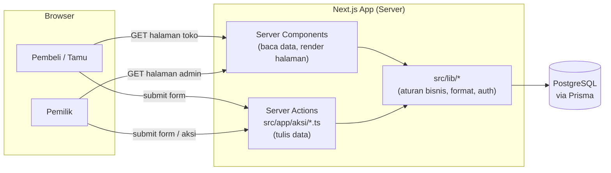
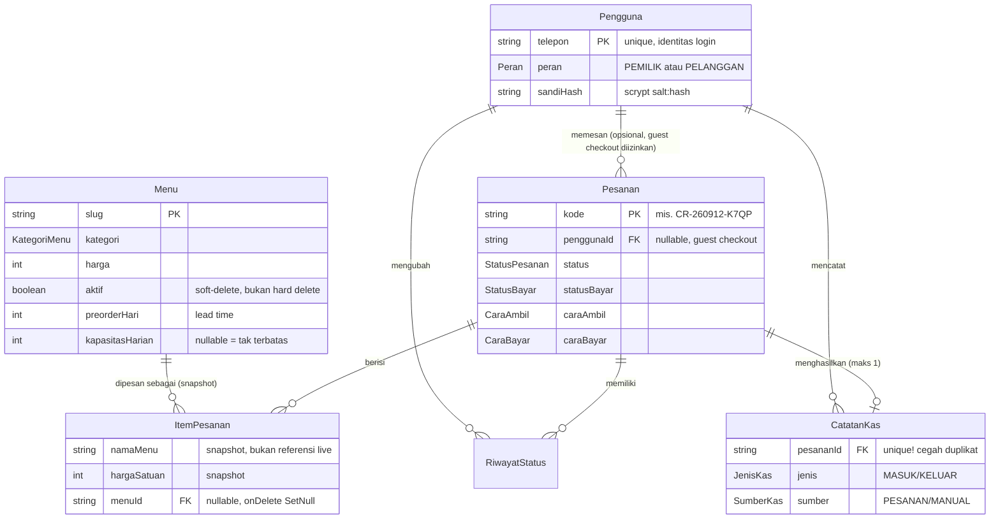
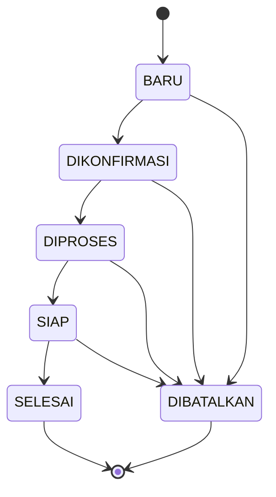

# Arsitektur — Citarasa Catering

Dokumen ini menjelaskan *bagaimana* sistem bekerja secara teknis. Untuk *apa* produk ini dan cara setup lokal, lihat [README.md](README.md). Untuk aturan kerja AI agent, lihat [AGENTS.md](AGENTS.md).

## 1. Gambaran umum

Satu aplikasi Next.js (App Router) melayani dua audiens dari satu database yang sama:



Tidak ada REST/GraphQL API terpisah yang bisa dipanggil dari luar — semua mutasi data terjadi lewat Server Actions yang dipanggil langsung dari form/komponen React di dalam aplikasi ini sendiri. Ini pilihan sadar: memastikan validasi harga & aturan bisnis **selalu** berjalan di server dan tidak bisa dilewati dari client.

## 2. Dua sisi, satu basis kode

| | Sisi toko `(toko)` | Sisi admin `admin` |
|---|---|---|
| Audiens | Pembeli & tamu | Pemilik usaha |
| Guard akses | Per-fitur (cookie tamu, atau login pelanggan) | Terpusat di `src/app/admin/layout.tsx`: redirect ke `/masuk` jika belum login, ke `/riwayat` jika login tapi bukan `PEMILIK` |
| Tujuan | Lihat menu, pesan, lacak status | Kelola pesanan (kanban), menu, kas, laporan, pengaturan |

Route group `(toko)` tidak muncul di URL — dipakai murni untuk berbagi layout (`KopToko` + `KakiToko`) tanpa memengaruhi path.

## 3. Model data



Model lain tanpa relasi kompleks: `TanggalTutup` (tanggal libur usaha, memblokir pemesanan), `Pengaturan` (baris tunggal `id: "utama"` — nama usaha, kontak, rekening bank, ongkir default, dll).

Detail penuh field ada di `prisma/schema.prisma` — itu sumber kebenaran, dokumen ini hanya ringkasan.

### Kenapa snapshot di `ItemPesanan`?

Jika `Menu` diedit atau dihapus setelah pesanan dibuat, struk/riwayat pesanan lama tidak boleh berubah retroaktif. Maka `namaMenu`, `hargaSatuan`, `satuan` disalin ke `ItemPesanan` saat pesanan dibuat, dan `menuId` boleh jadi `null` (`onDelete: SetNull`) jika menu aslinya dihapus.

## 4. Alur status pesanan

Didefinisikan di `src/lib/pesanan.ts` (`ALUR_STATUS`, `bolehPindahStatus`).



Status pembayaran berjalan independen dari status pesanan:

```
BELUM_BAYAR → MENUNGGU_VERIFIKASI (pembeli klik "Sudah Transfer") → LUNAS (pemilik verifikasi)
```

Saat `statusBayar` diubah menjadi `LUNAS`, sistem otomatis membuat satu baris `CatatanKas` (`sumber: PESANAN`) — lihat invarian #3 di AGENTS.md. Papan kanban admin (`KOLOM_PAPAN`) menampilkan kolom BARU → DIKONFIRMASI → DIPROSES → SIAP.

## 5. Pembuatan pesanan — aturan bisnis di server

`buatPesanan` (`src/app/aksi/pesanan.ts`) berjalan di dalam satu Prisma `$transaction` dan melakukan, secara berurutan:

1. Validasi input dengan Zod (bentuk data, bukan aturan bisnis).
2. Untuk tiap item: baca ulang `Menu` dari DB — **abaikan harga yang dikirim browser**.
3. Tolak jika menu tidak `aktif`.
4. Tolak jika tanggal acara ada di `TanggalTutup`.
5. Tolak jika jumlah < `minPesan` menu tsb.
6. Tolak jika tanggal acara kurang dari `preorderHari` hari dari sekarang.
7. Tolak jika total pesanan pada tanggal itu (untuk menu dengan `kapasitasHarian`) sudah melewati kapasitas — dihitung dari pesanan lain yang belum `DIBATALKAN` di tanggal sama.
8. Hitung ongkir dari `Pengaturan` (mis. gratis di atas `minOrderAntar`).
9. Generate kode pesanan unik (`buatKodePesanan`, retry jika tabrakan).
10. Tulis `Pesanan` + `ItemPesanan[]` + entri awal `RiwayatStatus`.

Jika mengubah fungsi ini, pertahankan urutan validasi ini (fail-fast) dan tetap di dalam satu transaction.

## 6. Model akses & keamanan

### Sesi login

- Cookie `sesi_citarasa`: httpOnly, JWT (HS256, ditandatangani dengan `SESSION_SECRET` via `jose`), umur 30 hari.
- Password: `scrypt` bawaan Node, disimpan sebagai `salt:hash` (hex), diverifikasi dengan `timingSafeEqual` (mencegah timing attack).
- Identitas login = **nomor telepon**, bukan email.

### "Siapa boleh lihat pesanan siapa"

Tidak ada satu mekanisme akses tunggal — kode pesanan **bukan** kunci rahasia. Tiga jalur sah untuk melihat detail sebuah `Pesanan`:

1. **Cookie tamu** `pesanan_saya` (`src/lib/akses-pesanan.ts`) — menyimpan hingga 25 kode pesanan terakhir yang dibuat dari browser itu, 180 hari.
2. **Login sebagai pemilik** (`peran: PEMILIK`) — bisa lihat semua pesanan lewat `/admin`.
3. **Cocokkan nomor telepon** di halaman `/lacak` — pembeli memasukkan kode + nomor telepon yang dipakai saat memesan.

Saat menambah fitur baru yang membaca `Pesanan`, pastikan salah satu dari tiga jalur ini diterapkan — jangan buat endpoint yang expose data pesanan hanya berdasar `kode` di URL tanpa pengecekan tambahan.

### Guard admin

Terpusat satu tempat: `src/app/admin/layout.tsx`. Semua halaman di bawah `src/app/admin/**` otomatis terlindungi karena mewarisi layout ini — tidak perlu (dan jangan) menduplikasi pengecekan auth di tiap halaman admin.

## 7. Zona waktu

Semua logika tanggal bisnis (rentang laporan bulanan, cek `preorderHari`, cek `TanggalTutup`, timestamp yang ditampilkan) dihitung dalam **WIB (Asia/Jakarta)**, bukan timezone server. Helper terpusat di `src/lib/format.ts` dan `src/lib/laporan.ts`. Jangan gunakan `new Date()` mentah untuk logika ini — pakai helper yang sudah ada supaya konsisten walau server berjalan di UTC.

## 8. Deployment

Aplikasi ini **memerlukan server Node.js yang hidup** (SSR + Server Actions), bukan static export/edge-only. Kebutuhan produksi:

- PostgreSQL yang bisa diakses dari server.
- Env var: `DATABASE_URL`, `SESSION_SECRET` (acak, ≥32 karakter, kebocoran = penyerang bisa memalsukan sesi), `NEXT_PUBLIC_BASE_URL` (dipakai untuk link WhatsApp).
- `npm run db:deploy` dijalankan setiap ada migrasi baru, sebelum `npm run build && npm start`.

Tidak ada konfigurasi CI/CD (`.github/workflows`), `Dockerfile`, atau `vercel.json` di repo ini saat ini — lihat [TASKS.md](TASKS.md).

## 9. Folder `legacy/`

Berisi versi lama proyek ini: marketplace multi-vendor dengan Express.js + HTML statis + Firebase Hosting. **Sudah diarsipkan**, dikeluarkan dari build (`next.config.ts`) dan typecheck (`tsconfig.json`). Jangan jadikan acuan pola arsitektur untuk kode baru — stack-nya sudah sepenuhnya berbeda (Express/JS vs Next.js/TS). Hanya berguna sebagai referensi historis fitur apa yang pernah dicoba (lihat `legacy/README-marketplace-lama.md`).
